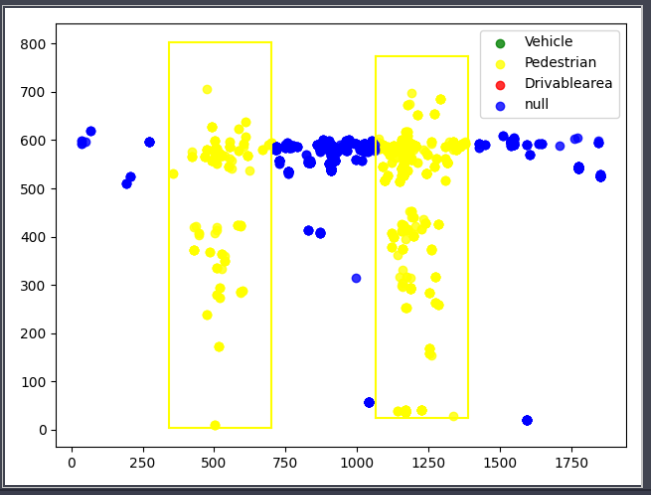

- 1：完成空间标定论文整理和综述撰写
	- 基于标定目标的
		- 直接转换（雷达3D坐标系至相机坐标系）
		- 通过标定外参矩阵（雷达3D坐标系对齐相机3D坐标系）
	- 基于非特定标定目标的
		- 通过雷达检测速度标定
		- 通过数据驱动的模型
- 2：完成时间标定论文整理和综述撰写
	- 通过软件手段标定
	- 通过硬件手段标定
	- 通过对齐目标进行标定
- 3 ：完成标定方案设计与实现
	- [[方案]]
- 4：完成雷达目标检测标定和语义分割标注以及可视化代码开发
	- 基于视觉标定的bounding box标注雷达数据在图像中的像素值和label值
		- 通过标定矩阵求出雷达3D坐标对应的像素值
		- 根据视觉的bounding box和语义分割多边形提供的lable值和范围赋予雷达对应像素值的label
	- 可视化
		- 
		- Todo 3D可视化
-