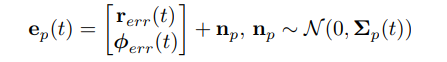
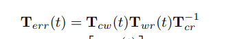
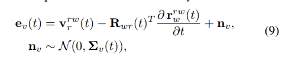
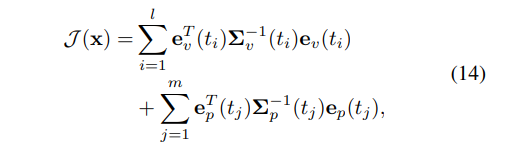

- 
- based on Trajectory of radar and camera to build error equation for optimization H
- using cumulative B-spline representation to parameterize trajectories
- magmatically theory
	- for camera pose
		- the error equation for any time t
			- 
			- 
				- $T_{cw(t)}$ is the homogeneous matrix  for radar to word(can be expressed by velocity)
				- $T_{wr}$ can be expressed
				- $T_{cr}$ is the target homogeneous matrix
	- for radar speed
		- the error equation for any time t
			- 
			- $R_{wr(t)}$ is the rotation matrix and $r_w^{rw}$ is the translation matrix. These two can construct the $T_{wr}$
			- $v_r^{rw}$ is detectable speed for radar
	- the cost function is defined as:
		- 
	-
-