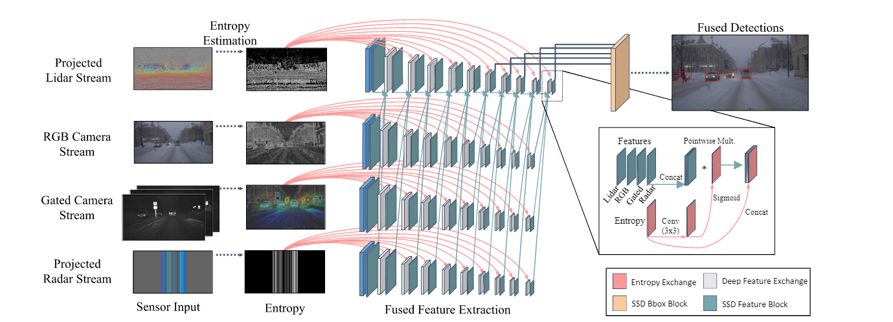
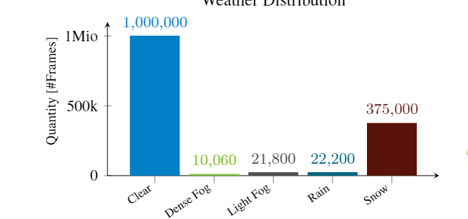
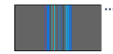
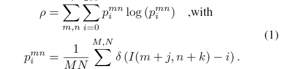
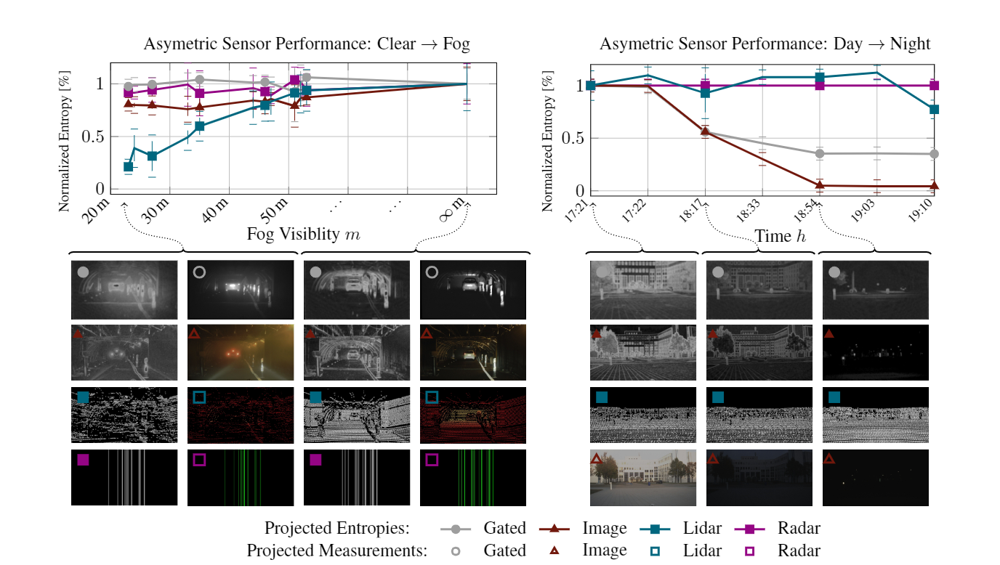
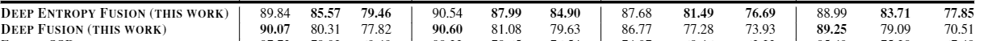

title:: Dense:Seeing Through Fog Without Seeing Fog: Deep Multimodal Sensor Fusion in Unseen Adverse Weather

- 
- 贡献：
	- 提供多场景的传感器融合数据（雨天，雾天，雪天）
	- 提供熵驱动的自适应数据融合方案
- 数据集
	- 
	- 0.1Hz per frame
- 融合架构
	- 数据输入形式：
		- lidar：深度，高度，强度
		- radar：形成与图片水平方向平行的pillar
			- 
	- 特征处理
		- 熵导向融合（创新）
			- 为每一个模态计算熵通道
			- 熵的计算基于受控雾室内的动态场景和自然光照设置变化的静态场景。
			- 
			- 自我理解：根据先验知识（自定义的室内雾环境和变化的自然光）为每个场景设置一个熵
			- 
			- 如雾气比较浓的时候lidar和camera的滴就会很低
			- 如在夜晚能见度较低时，radar和lidar的滴就会很高。
		- 特征提取：VGG
		- head：SSD
- 实验比较
	- 消融实验：是否使用entropy进行对比
		- 
	- 对比实验
		-
		-