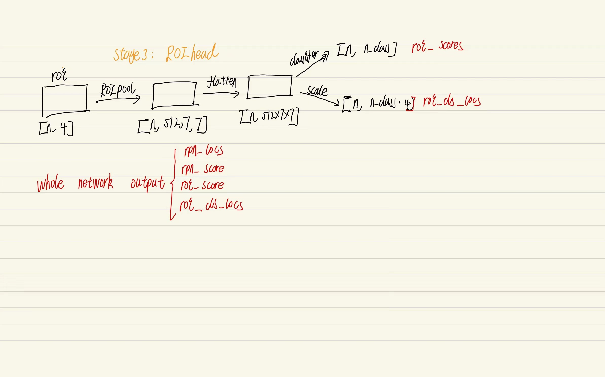
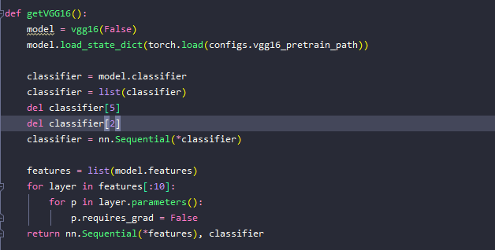
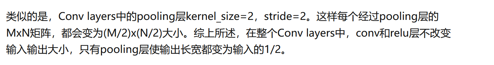
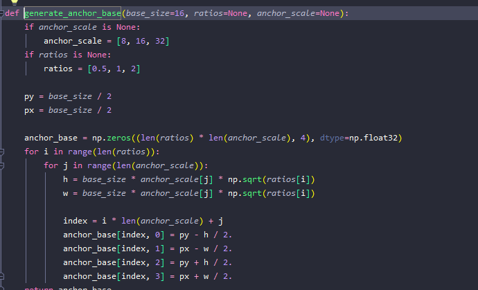
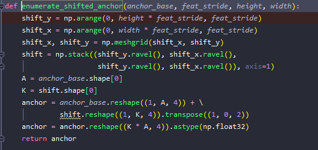
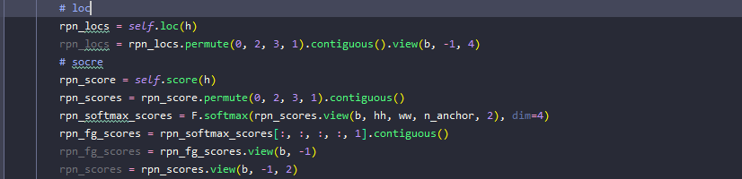
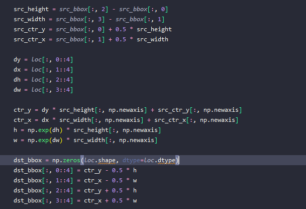
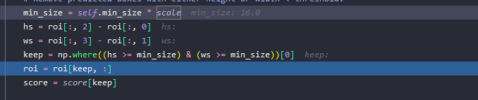
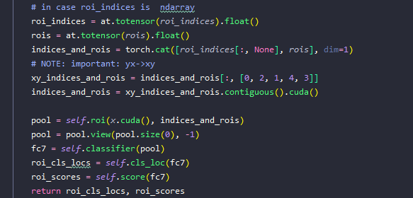

- https://zhuanlan.zhihu.com/p/31426458
- Network
	- {:height 474, :width 746}
	- 
	- stage 1: image to feature map
		- {:height 326, :width 628}
		- (1,  3, 800, 600) to (1, 512, 37, 50)
		- 
	-
	- stage2 RPN
		- First: 生成基本锚点，根据不同的长宽比和不同的scale定义9点不同的锚点框
		- 
		- Secondly, 根据第一层vgg16得到的feature map(1, 512, 37, 50) ，在37*50的每个点中定义第一步中9点不同的锚点框。步长为VGG中缩小的倍数
			- {:height 257, :width 528}
		- Thirdly, 将feature_map(1, 512, 37, 50) cov成 （1，anchorx2， 37， 50） 和（1，anchorx4，37，50)，分别用于锚点的positve和negative判断和进行bounding box regression。
			- 
			- rpn_locs: （B, hh X hw X anchor_number, 4）
			- rpn__fg_scores (B, HH, WW, n_anchor, 2) ==>softmax==>(B, HH, WW, n_anchor, 1) to (BxHHxWWxn_anchor, 1)
			- rpn_scoes (B, anchor_n x 2, HH, WW)
			- anchor (BxHHxWWxn_anchor, 4)
		- 第四步，proposal_layer 生成ROI， 输入（image_size, anchor, rpn__fg_scores , rpn_locs）
			- encoding  rpn_losc （sclae）和锚点(offset)  生成bbox
				- 
			- 筛选ROI：
				- remove too small region
					- 
				- select based on nms(score-->rpn__fg_scores  and ROI-->anchor and rpn_losc  )
			- 返回满足条件的n个ROI（much less than rpn_losc ）
		- stage3 ROI head
			- 对于n个ROI，首先进入ROIpooling层，生成n x 7 x 7 feature map
			- 然后进行bound box regression（对boundbox进行更精确的rect）和分类（用于计算得分）
			- 
	-