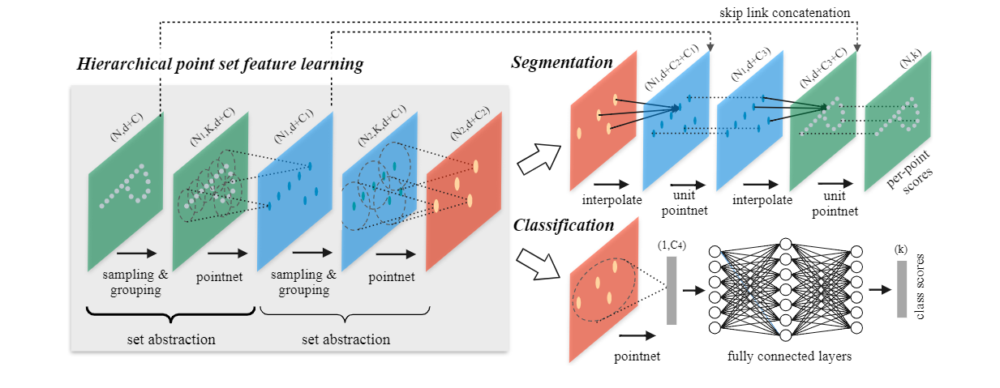
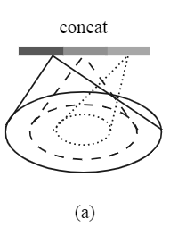
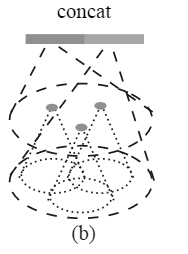

- 
- 核心价值：为基于点集的深度学习算法提供上下文特征
- 待解决问题：1： 如果产生sub-点云集 2：如果为sub集中的局部特征建立学习网络
- 方法策略
	- 产生sub-点云集: 利用cluster算法，iterative farthest point sampling(FPS)选择若干中心点。
	- 学习cluster之后的局部特征：pointnet
- 另一亮点：解决稀疏点云局部邻域没有很好的特征表示
	- 解决方案一：
		- 
		- 对于同一个中心，取多个不同的半径，并进入MLP网络并在通道层整合这些特征。（expensive）
	- 解决方案二：
		- {:height 262, :width 188}
		- 分为两部分， 前部分特征由上部分的的点的特征合组成，后部分为这一层局部领域特征组成。
	- 缺点：
		- 多次cluster运行慢，难以并行
		- 缺乏与视觉框架融合的条件
- [[pointnet++代码]]
-
- Refernce: Qi, Charles R., et al. "Pointnet: Deep learning on point sets for 3d classification and segmentation." Proceedings of the IEEE conference on computer vision and pattern recognition. 2017.