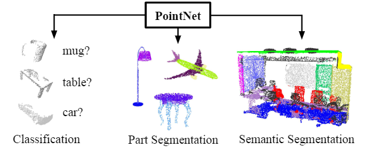

- 
- 作用：直接利用点云数据进行神经网络训练
	- 可以对点云集属于哪一类进行分类或者可以为每个点打上对应的标签（语义分割）
		- {:height 262, :width 657}
- 点云在深度学习中的困难
	- 无序性：和图像或者gride不同，不同的矩阵可能会表示为相同的点云
	- 点之前存在相互作用：一个点定义的标签往往被其附近的点影响，与图像类似
	- 对刚性变化需要保持不变性: 对于一个点云集，经过刚性旋转，他的特征应该保持不变。
- PointNet做出的策略
	- 无序性：根据每个点利用多层MLP对特征进行扩充（由3维扩充至1024维). 然后对nx1024做maxpooling操作（maxpoling对顺序性不敏感）。
		- 
	- 点之间的相互作用：
		- 物体检测：通过全局maxpooling操作，可以提取点云集的全局特征对物体类别进行判断。
		- 语义分割：通过将全局maxpooling之后的特征与经MLP处理之后的点特征进行通道的contact，来保证全局特征可以被用于语义分割任务中。
	- 刚性变化：采用预测T矩阵网络来保证点云处于同一确定坐标系下。
		- 其网路结构与pointnet非常相似
		- 
		-
	- 缺点:
		- 1: 仅融合了全局特征，未考虑上下文关系对分割分类造成的影响
		- 2：全局特征提取速度缓慢
-
- [[pointnet代码]]
-
- Reference:
	- Qi, Charles R., et al. "Pointnet: Deep learning on point sets for 3d classification and segmentation." Proceedings of the IEEE conference on computer vision and pattern recognition. 2017.