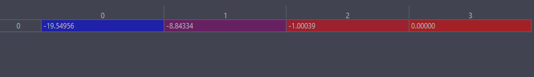
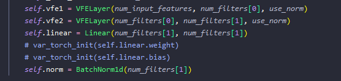
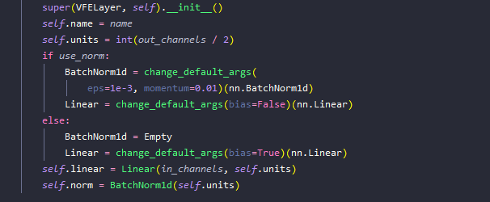
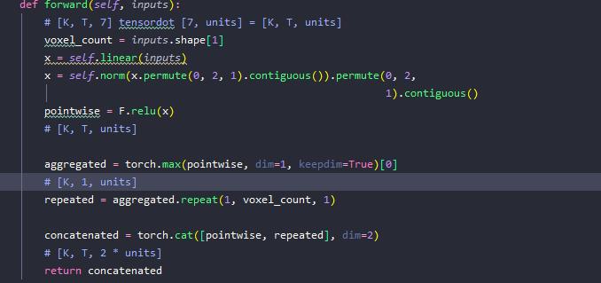

- 数据清洗
	- 读取nuscence标签信息（雷达path， 雷达位姿标定信息，boundbox消息等）并保存相关至pkl文件
		- second.create_data.nuscenes_data_prep
			- second.data.nuscenes_dataset.create_nuscenes_infos
				- second.data.nuscenes_dataset._fill_trainval_infos（获取具体信息）
- 输入数据的结构
	- voxels （N，M,  F）N：voxel 数量 M：一个voxel里的点数量 F：位置信息
		- 
collapsed:: true
			-
	- num_points: batch里总点数
	- coordinates: (N, F): N:总点数 F：对应的voxel坐标
	- anchors:（B, N ,F）F为回归维度
	- label: 每一个anchor对应一个label
	- gt_names：batch包含的实例名字。
	- reg_targes: reg对应的真实gt
- 网络结构：
	- second.pytorch.models.voxelnet.VoxelNet（分为VoxelFeatureExtractor， SparseMiddleExtractor和RPN）
		- VoxelFeatureExtractor： second.pytorch.models.voxel_encoder.VoxelFeatureExtractor
		- {:height 141, :width 556}
			- VFE layer
				- 
				- 核心 pointnet实现于单voxel内
collapsed:: true
					- 
		- second.pytorch.models.middle.SparseMiddleExtractor
		- second.pytorch.models.rpn.RPN