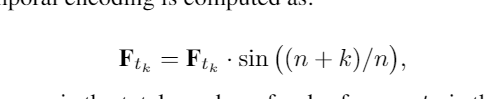
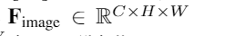

- 
- {:height 290, :width 628}
-
- 数据源：3D radar points cloud 和 RGB images
-
- 融合类别：特征融合
-
- 数据处理部分：
	- 雷达：
		- 1 ：采用pseudo image方式，文章称为 radar point density map
			- 伪图像三通道分别为
				- 
				  r 为位置的平方和，v为速度，p为RCS
				-
		- 2：为解决单frame雷达点数过少问题，采用前面部分帧的雷达数据合成为一帧。
			- 
			- 思考：是否采用该frame的前后几frame，而不是后frame效果会更好
			  background-color:: #793e3e
		- 3 使用VGG-13 backbone提取特征，然后使用Self-Attention Block增加真实的目标点减少噪声
	- 图像：
		- 使用CSPdarknet53提取特征
- 融合特征：采用全局注意力来融合特征
	- 输入： {:height 48, :width 247} and 
- neck + head： 文中只介绍采用feature pyramid networks作为识别网络，并未详细介绍
-
- 实验部分：
	- 鲁棒性实验
		- 对于雷德，用不同CFAR，得出AP比不用雷达要高的结论
		- 针对视觉，用不同的亮度，得出无论何种亮度，雷视融合比纯视觉准确率高
	- 消融实验
		- 输入的雷达数据形式，用point和point++比较
		- 对于系统架构，用控制单一变量来比较
-