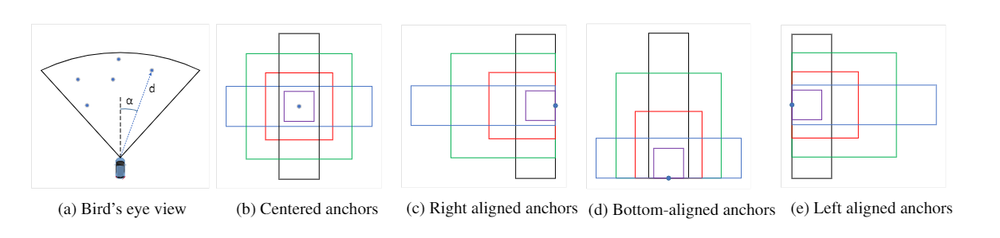

title:: RRPN: RADAR REGION PROPOSAL NETWORK FOR OBJECT DETECTION IN AUTONOMOUS VEHICLES

- 改进目标：由于faster-RCNN等基于RPN的网络，在锚点创立以及修正等过程中耗费的资源较多，行动缓慢。使用雷达产生的点产生pre-defined的锚框，减少了纯视觉过程中锚框创立的过程。
-
- 数据集： NuScene
-
- 数据形式：点云+image
-
- 数据标定：使用DLT将雷达3D坐标投射到像素坐标系上
-
- 核心部分：基于雷达点的锚框生成
	- 为应对雷达点不是会映射到物体的中心，且雷达不会反映出物体的物体大小的这一特点。
	- 
	- 基于faster-RCNN的思想，生成多size的锚框，并且锚框的中心不仅仅根据雷达中心点来选取。
-