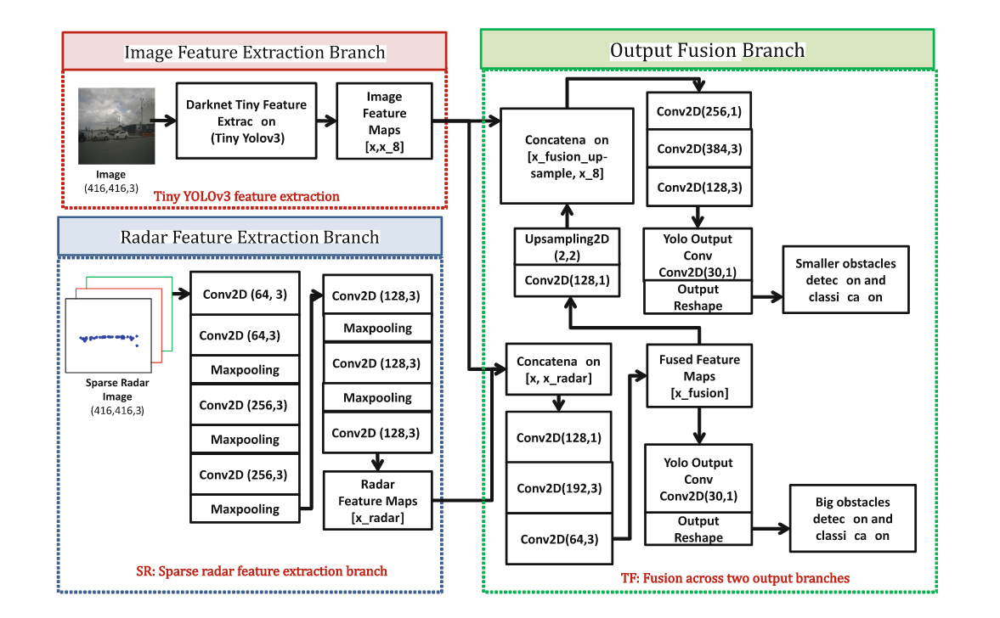
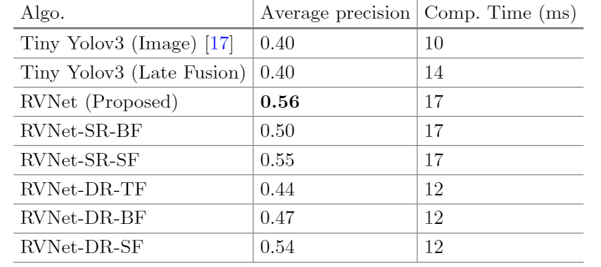

title:: RVNet: Deep Sensor Fusion of Monocular Camera and Radar for Image-Based Obstacle Detection in Challenging Environments

- 
-
- 融合类别：特征融合
-
- 识别网络：yolov3
-
- 数据特征处理
	- 雷达
		- 3D雷达点投影到image里，生成点图
		- 根据点图生成与图像长宽一致的3通道伪图像（深度，侧向速度，纵向速度）
		-
	- 图像
		- 基于yolov3
- 融合过程
	- 基于特征图，直接在深度层进行concatenate
-
- 实验部分
	- 修改网络结构验证最好的实验效果
		- 修改输入部分
			- 雷达点图生成密集点图采用5通道（深度，侧向速度，横向速度，图像横坐标，图像纵坐标）
		- 修改输出部分
			- 改为仅仅大目标检测用雷视融合或者仅仅小目标检测用雷视融合
	- 对比实验
		- 仅视觉的yolov3和上文提及的网络变种进行比较
			- 