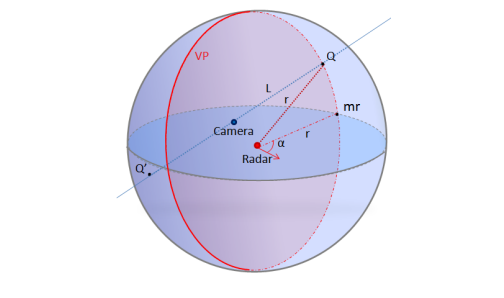
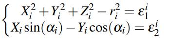
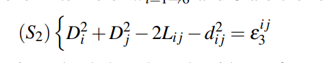
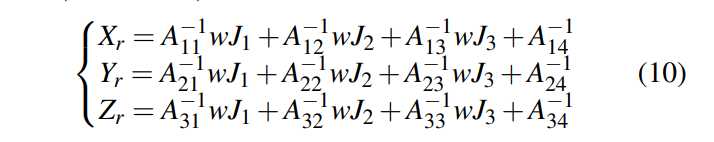

- 
- Based on the inter-targets distance, Unlike DLT, do not need specific design to ensure that exact intersection of the target with the horizontal plane of the radar
- Calibration mathmatical
	- 
	- keep three residuals minimize:
	  
	  {:height 100, :width 472}
	  $x_2$ $y_2$ $z_2$ is the radar 3D location, r is radar depth and $\theta$ is the azimuth angle.
	  
	  radar points can be calcuated by
	  
	-
- Tip
	- New optimization residuals minimize way, improve the robustness of calibration approaches(do not need at the same horizon)
	- for 4D MMW, we should set target to different horizonal plan compared with radar plane to gain the elevation information.