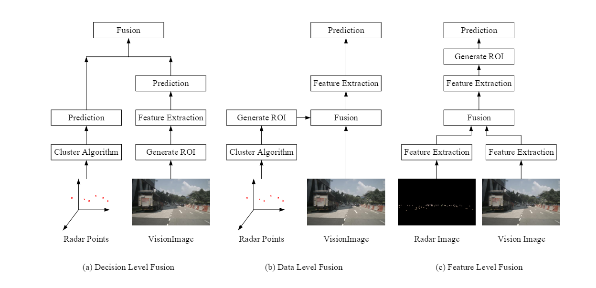

title:: SAF-FCOS: Spatial Attention Fusion for Obstacle Detection Using MmWave Radar and Vision Sensor

- 
-
- 使用数据集： nuScenes
	- the nuScenes dataste is split as training dataset, validation dataset and test dataset,which have 700 scenes, 150 scenes and 150 scene
- 数据处理：
	- radar
		-
-