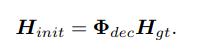

- 
- estimate rotational matrix of extrinsic calibration matrix by DL
- manually measure the translation parameters
- Cascaded Residual Learning is utilized
  id:: 6235d11f-bd39-4536-aa1c-bd3bc27bb4cf
- mathematically
	- 
	- estimate $$\Phi_{dec}^{-1}$ to recover $$H_{gt}$$
-
-