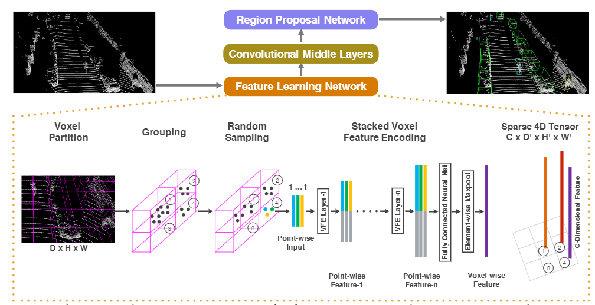

- 
- 主要思想：将点云划分为等间距的3D块，并根据块里的点提取特征。之后块的特征会通过maxpooling块里点的特征得到。
- 实现细节
	- random sampling 确保每个块里的点不多于阈值
	- 将得到了离散的3D特征块映射到3D离散的tensor中，进而压缩高度信息得到类似图片的2D特征图。
		- {:height 473, :width 716}
- 缺点：
	- 离散的3D卷积耗时过大
-
-
- Reference： Zhou, Yin, and Oncel Tuzel. "Voxelnet: End-to-end learning for point cloud based 3d object detection." Proceedings of the IEEE conference on computer vision and pattern recognition. 2018.
	-