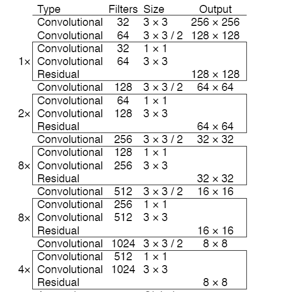
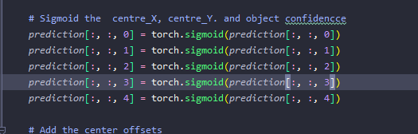
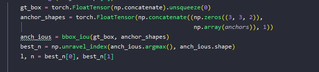
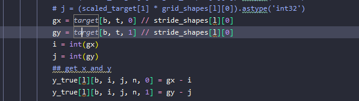

- 解释的很好的博客参考
	- https://blog.paperspace.com/how-to-implement-a-yolo-object-detector-in-pytorch/
	- https://zhuanlan.zhihu.com/p/31427164
- based on yolov3
- feature extraction --- Darknet-53.
	- 
	- https://raw.githubusercontent.com/pjreddie/darknet/master/cfg/yolov3.cfg
	- input（B, 3, 416, 416) =====> output（B, 255, 13, 13)
- yolo head
	- input （B, 255, 13, 13)， （B, 255, 26，26)， （B, 255, 52, 52）
	- output:  (batch_size, grid_size, grid_size, num_anchors, bbox_attrs)
- loss设计
	- 构造
		- x, y为在当前网格的偏差
		- w,h 为相当于当前锚点的便宜
	- pred
		- 
		- 输入全部归一化
	- true
		- anchors
			- 确定与当前target最相近的IOU
			- 
			- 只使用这个锚点下的值
		- x,y
			- 
			- 真值除以缩小值 减去int值为x, y相当于当前网格的偏移值
		- w, h
			- 
			- w, h 为 真值除以锚点值得到的数值
-