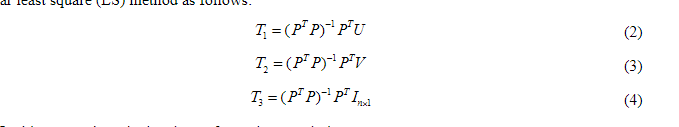

- 
- radar is in 2D coordinate
- target object
	- no specific describe. just trihedral corner reflector
- calibration mathmatical
	- collect all pair points of radar and camera.
	- using linear least square method to get transformation matrix
	  
-