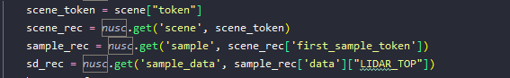
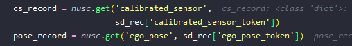
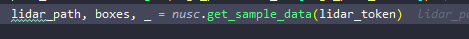
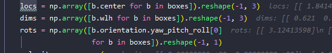

- 官网 https://www.nuscenes.org/nuscenes   （提供工具包，练习和数据）
-
- 
	- 默认将数据集分为测试集，训练集，验证集。
- 数据结构
	- 主数据集部分
		- 由每一个scene构成，每一个scene包含多个frame，frame里有各个传感器的data
		- 
	- 标定部分，包括标定和位姿信息。each sample
		- 
	- annotations
		- boundbox包括
		- 
		- {:height 96, :width 551}