- Python 3.8, CUDA 11.3, cuDNN 8, NVCC, Pytorch 1.11.0, torchvision 0.12.0, torchaudio 0.11.0
- 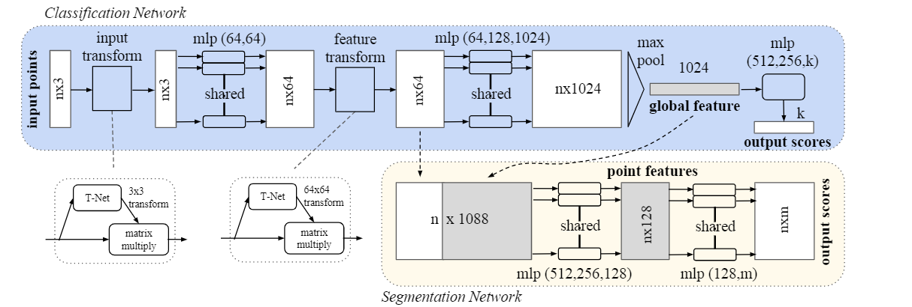
- 网络架构
	- transform network
	- 网络结构
		- 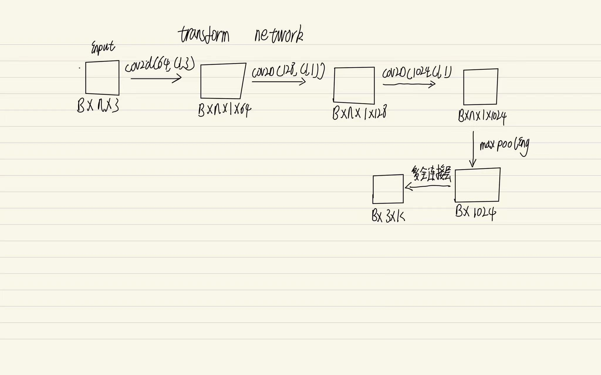
	- 代码实现
		- 前端的MLP， 从3维度扩充至1024维度（B, 3, N）to (B, 1024, N)
			- 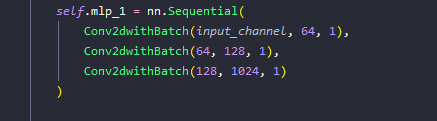
		- 在点的维度进行maxpooling操作 （B, 1024, N）to (B, 1024)
			- 
		- feature维度缩减， 由1024 至9
			- 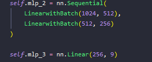
		- 将feature转换为tranfrom maxtrix形式
			- 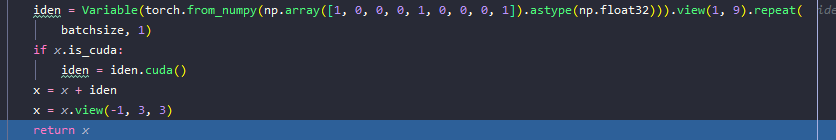{:height 98, :width 538}
		- 将3*3的矩阵与源数据相乘得到统一角度的图形 (B, C, N) multiple (C, C)
			- 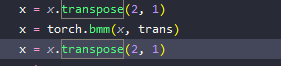
	- 扩充维度至64
		- 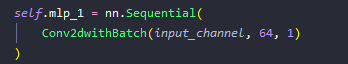
	- 64维度transform network
		- 与第一步的transform network类似（B, N=64, C）构建64*64的transform。 (B, 64, N) multiple (64, 64)
	- 扩充维度1024并执行maxpool在点的维度
		- 
		- 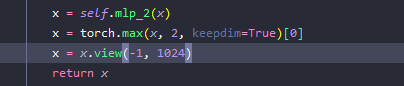
	- 全连接进行classification
		- 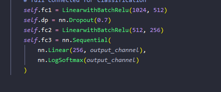{:height 192, :width 441}
		- {:height 72, :width 279}
- loss：negative log likelihood loss(todo)
- 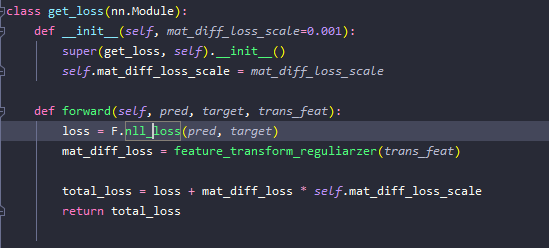
- 构建数据集（基于modelnet40）hdf5文件
	- 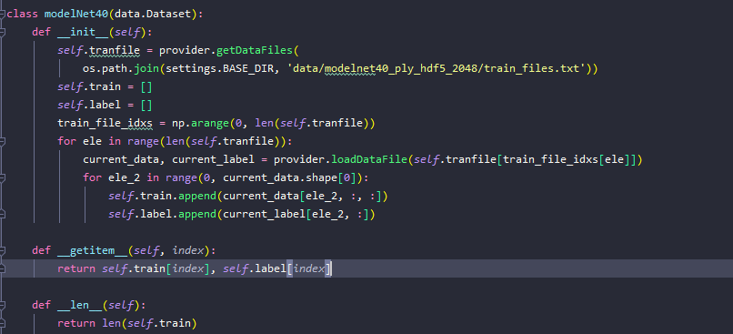{:height 348, :width 746}
- 训练
	- 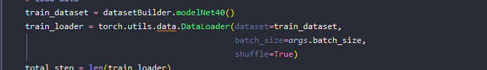{:height 94, :width 596}
	- 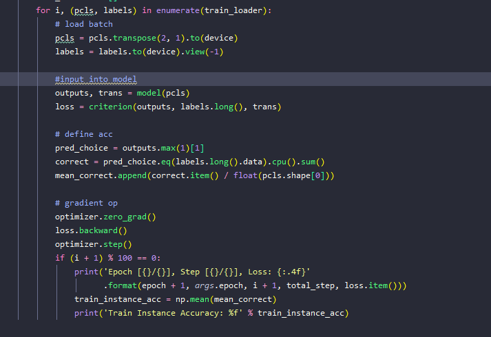
- 结果
	- expected result
	- 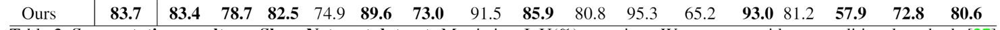
	- our result
	- 