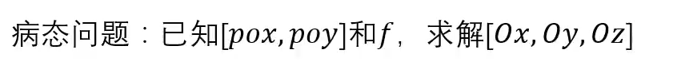
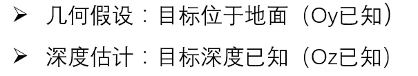
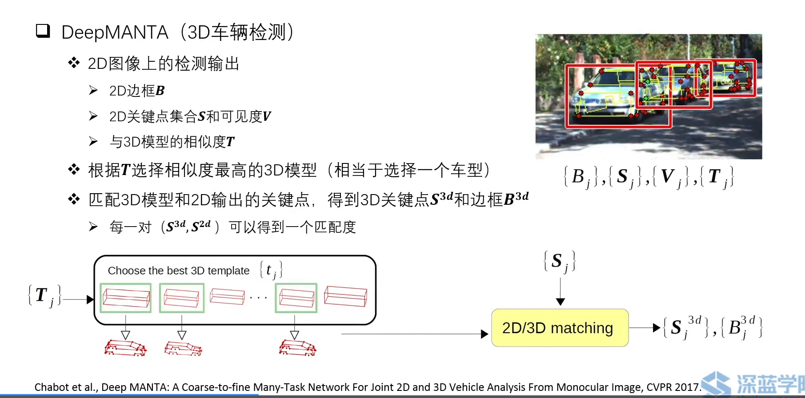
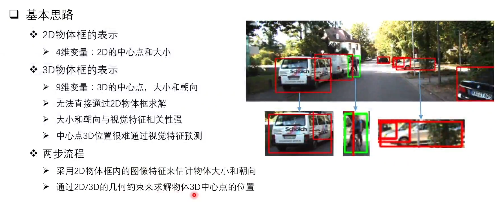
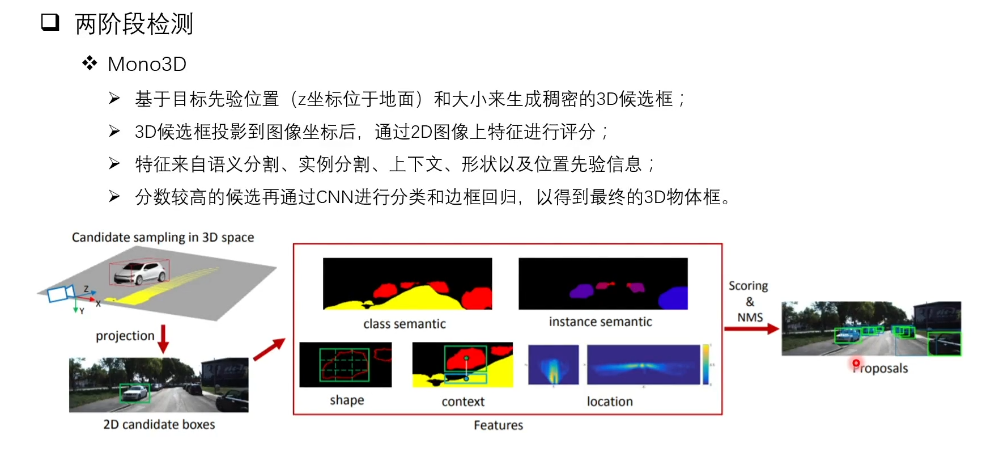
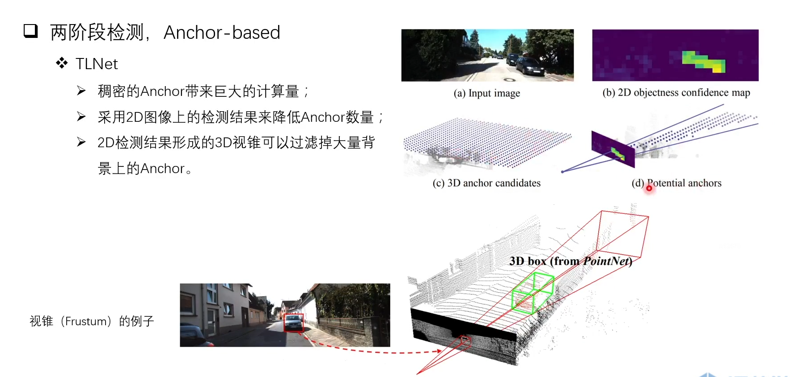
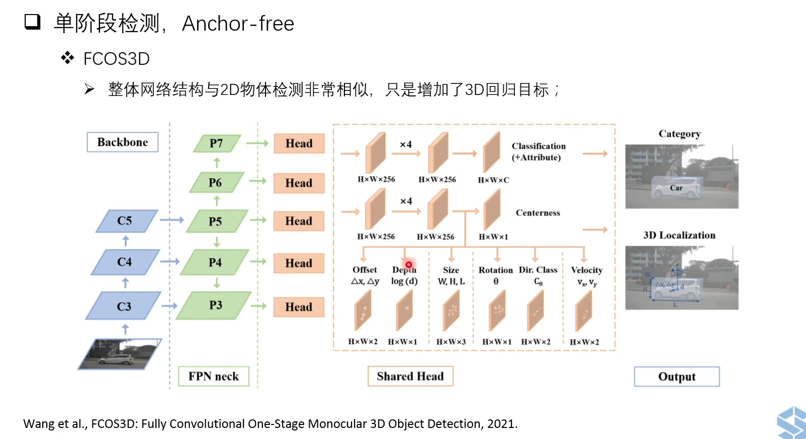
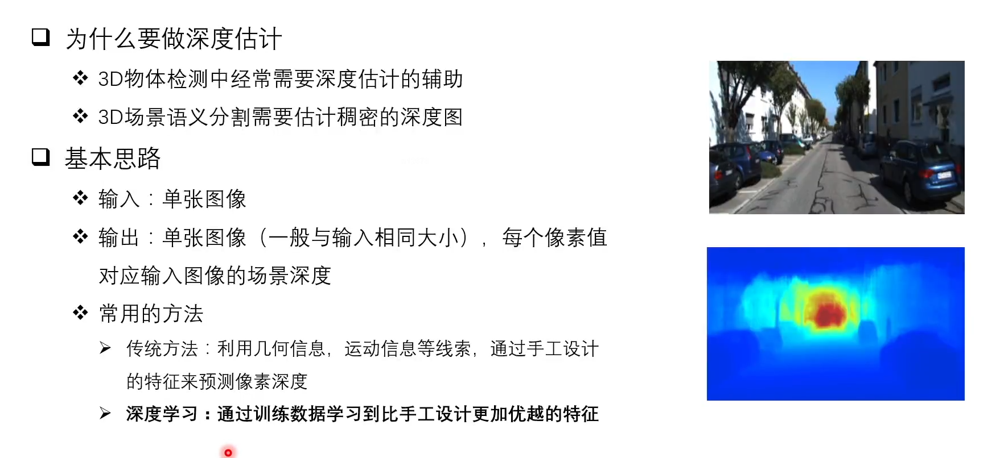
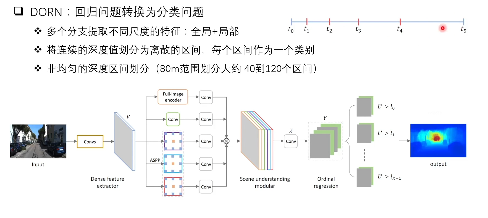

- 反变换：2D图像反变化到3D坐标，在进行物体检测
	- 病态问题
		- 
		- 可增加辅助信息
		  {:height 118, :width 605}
			- 假设目标位于地面
				- 2D图像可变化到BEV视图（仅能准确预测与地面平齐的物体部分）
			- 假设目标深度已知
				- 1：将图像数据转换为点云数据
				- 2：表示为RGB-D数据
					- 问题：远处物体检测不准确， 相邻像素深度差别大，不适合卷积操作
- 关键点和3D模型
	- 
- 2D/3D几何约束
	- {:height 318, :width 746}
- 直接预测3D信息
	- Mono3D
		- 
	- TLNet
		- 
	- 单阶段检测 anchor-free
		- 
- 单目深度估计
	- 
	- 
-
-
-