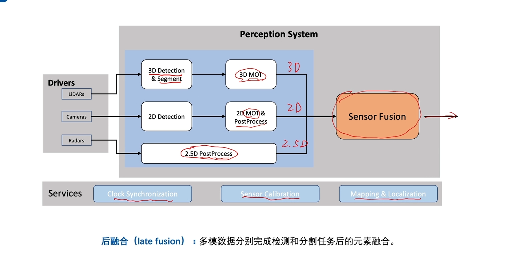
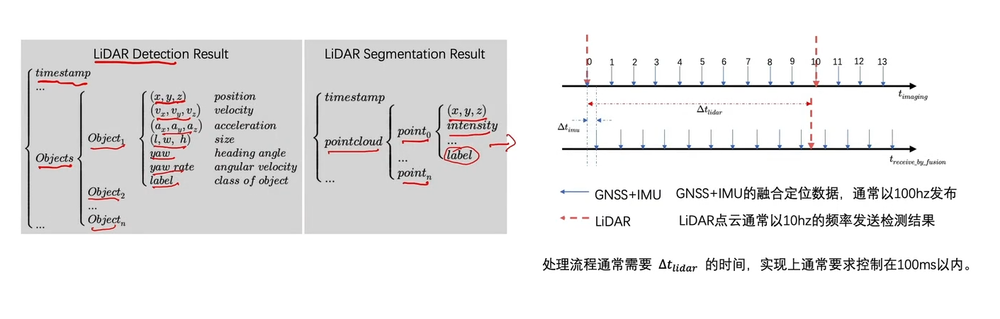
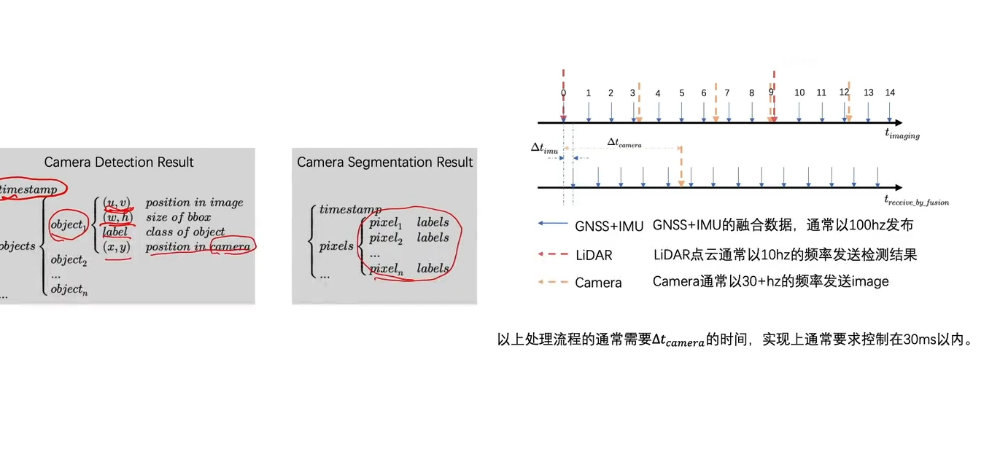
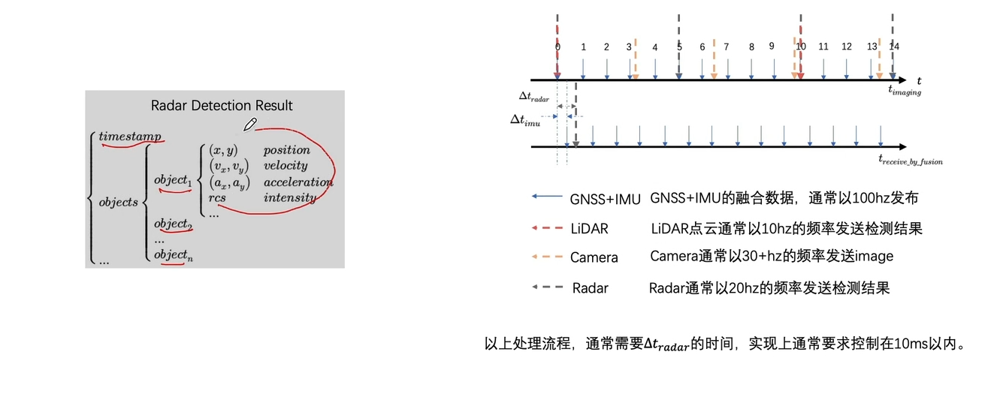
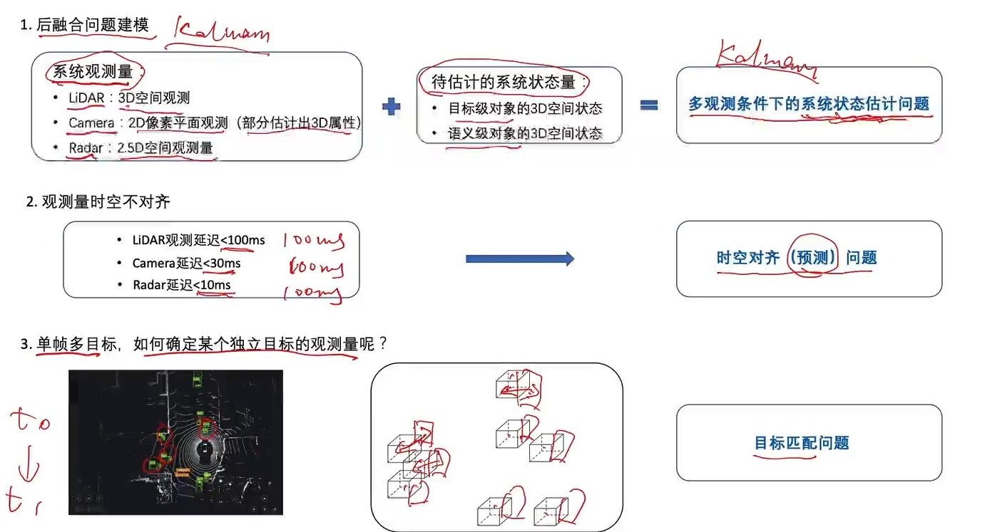
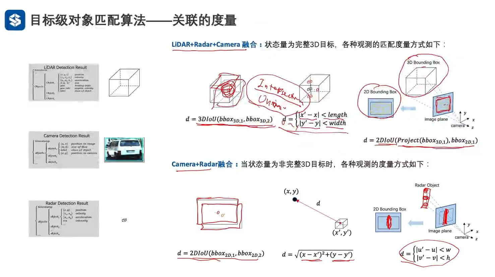
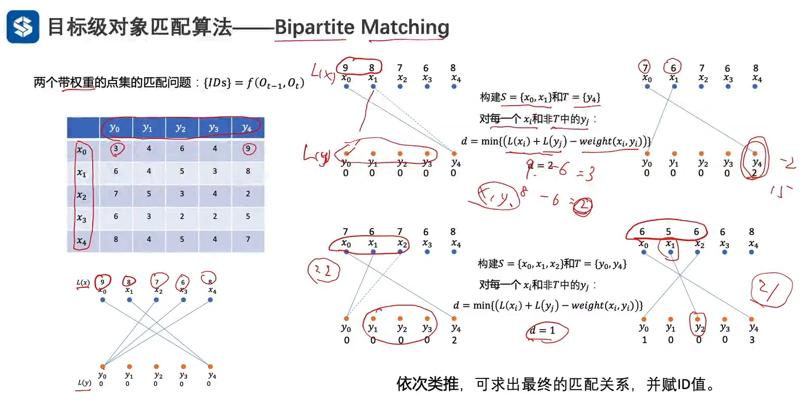

- 
- 输出信息
	- lidar
	- 
	- camera
		- 
	- radar
		- 
- 后融合需要解决的问题
	- 
- 目标跟踪
	- 目标级对象匹配算法-关联的度量
	  {:height 425, :width 746}
	- 目标级对象匹配算法-帧间匹配算法（多目标匹配） Kuhn-Munkers(KM) algorithm
		- 
- [[后融合算法设计与实现]]