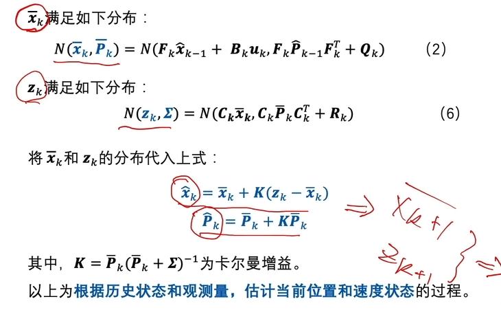

- 状态估计问题的求解思路
	- {:height 369, :width 746}
- Kalman滤波器（马尔可夫链）
	- 前一时刻和当前时刻状态转换关系
		- 
		- {:height 390, :width 746}
		- 根据均值和方差可以求出其下一状态的分布
	- 求当前观测量和状态量之间的关系
		- 
	- 求两个正态分布的乘积（当前观测量和状态量之间的关系和前一时刻和当前时刻状态转换关系）
		- 基础知识
			- 
			- {:height 703, :width 686}
		- 求$$x_k$$的后验分布
			- 
- Extented Kalman filter(为解决非线性状态转移问题)
- 目标级运动属性融合建模