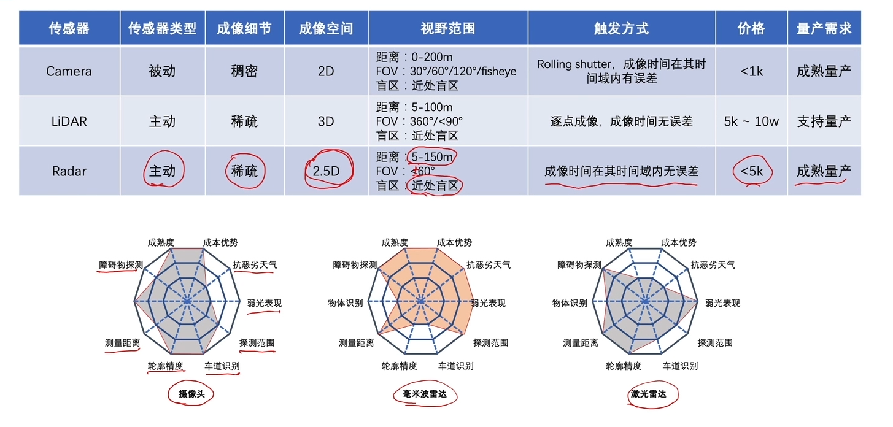

- 自动驾驶系统中的传感器与时序闭环
collapsed:: true
	- 感知传感器的成像机制
	  {:height 365, :width 746}
		- [[Radar成像机制]]
	- 自动驾驶传感器系统设计
		- [[整车传感器系统分析]]
- 多传感器系统的时序闭环
	- [[传感器时序闭环构建]] 在多传感器系统中，目前无法实现微秒级别同步
	- [[成像同步机制]]
	-
- 多传感器标定
	- [[为什么标定传感器]]
	- [[非线性优化]]
	- [[camera内参标定]]
	- [[外参标定]]
- 多传感器融合算法
	- [[后融合]]
	- [[前融合]]
	-