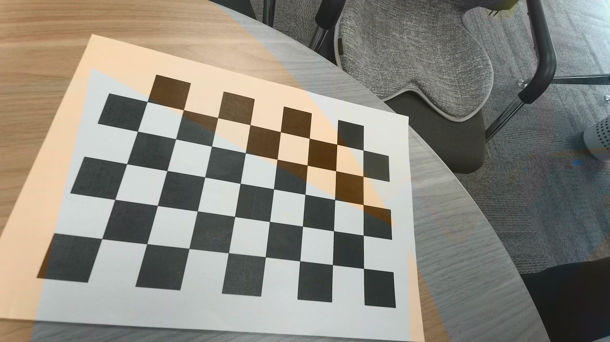
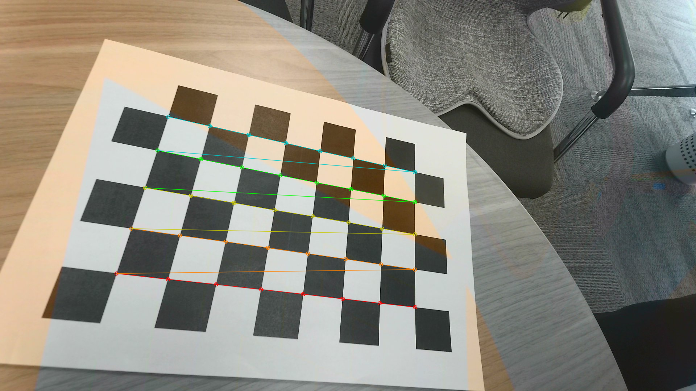
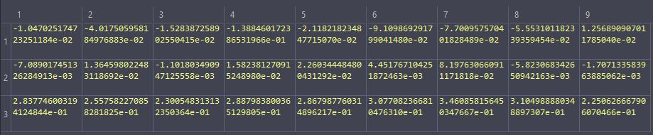
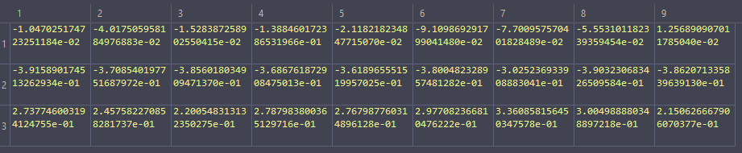
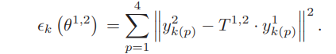
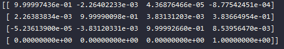

- 相机内参：张氏标定法
	- {:height 407, :width 593}
	- {:height 343, :width 596}
	-
- 相机雷达联合标定
	- pnp确定相机3D坐标点
		- 根据多张不同角度相机确定目标实际坐标和相机坐标之间的外参矩阵（通过最小二分法优化）
		- 根据多个角点确定角中心坐标（三角反射器位置）
		- 输出
		- {:height 156, :width 716}
	- 通过三角反射器确定雷达3D坐标点
		- 通过rcs值过滤出三角反射器的确切坐标。三角反射器位于角点群的中心
		- 输出
		- 
	- 联合标定
		- 通过优化6参数自由度实现标定（yaw, pitch, row, x, y, z）
		- 6参数可和外参矩阵之间自由转换。
		- Kabsch algorithm 用于初始化参数
			- 最小化两组点之间的rmsd值确定刚性变化的值
			- https://en.wikipedia.org/wiki/Kabsch_algorithm
		- Sequential Least SQuares Programming 用于优化6参数
			-
			- error : 
			-
		- 输出外参矩阵结果
		- 
		- Expected result
		- 
		-