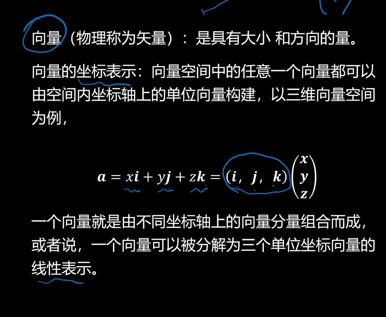
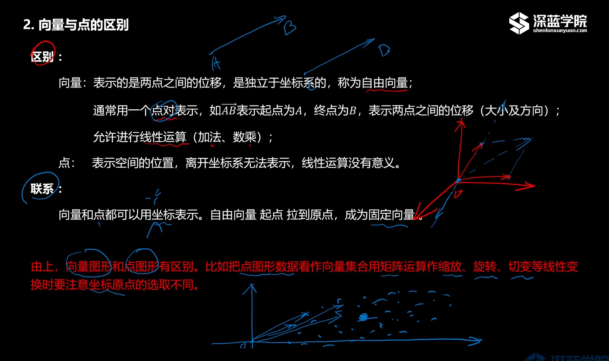
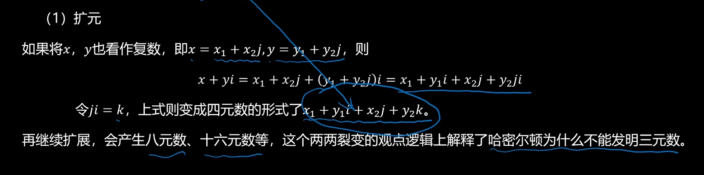

- 向量
	- 向量的概念
	  {:height 620, :width 746}
	  （i，j，k）通常省略。
	- 向量与点之间的区别
	  
	- 向量的种类
	  在数域中， 向量中有零向量，实向量，复向量，变向量。
		- 复向量
			- 扩元
			  
			- 扩维
			  对于实数x, y， 复数x+yi可以扩展为n维复合量， x为(xn), y为(yn)
	- [[向量的基本运算]]
-