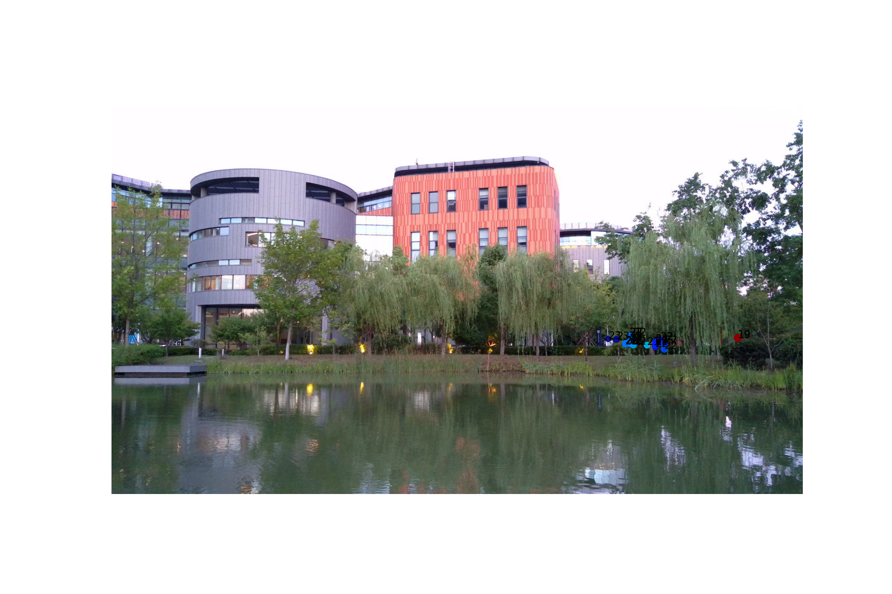
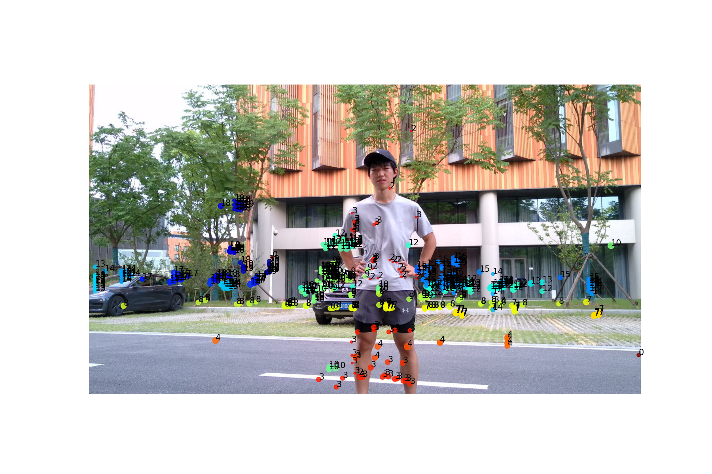

- 标定问题
	- 目前使用标定板得到的雷达点不准确，如何解决。
	- 如果不是使用标定板，使用类似Tracker/PCL Projection function的方案手动修正，有无标准模板可以提供
- 投影问题：
	- 目前一些场景的投影点如图，不知道是否正常(使用ubuntu平台system_test进行测试)
	- 
	- 
		- 
		- {:height 392, :width 576}
		-
	-